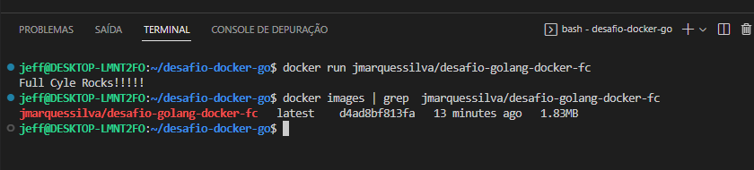

## DESAFIO DOCKER - GOLANG

Esse desafio é muito empolgante principalmente se você nunca trabalhou com a linguagem Go!
Você terá que publicar uma imagem no docker hub. Quando executarmos:

```
docker run jmarquessilva/desafio-golang-docker-fc
```

Temos que ter o seguinte resultado: 

```
FullCycle Rocks!
```

**A imagem de nosso projeto Go precisa ter menos de 2MB** 

 	

